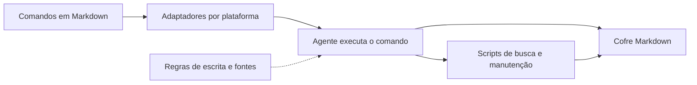

# Obsidian Second Brain — guia em português

Biblioteca de Eugeniu Ghelbur para usar um cofre Markdown como memória persistente de agentes de IA. O repositório reúne definições de comandos, referências de organização, scripts, adaptadores, integrações, exemplos e testes.

**Importado aqui:** os 354 arquivos estão catalogados e os originais estão preservados no ZIP. Esta importação de conhecimento não instalou o pacote, suas integrações, comandos ou agentes automáticos.

## Como o sistema foi organizado

| Camada | Para que serve | Documento |
|---|---|---|
| Comandos | Captura, pesquisa, revisão, decisões e manutenção | [[Cerebro/GitHub/Second-Brain/02-Catalogo-de-Comandos|Catálogo traduzido]] |
| Arquitetura | Relação entre comandos, adaptadores, scripts e cofre | [[Cerebro/GitHub/Second-Brain/Fontes/architecture.md.md|architecture.md]] |
| Modelo de notas | Propriedades por tipo de conhecimento | [[Cerebro/GitHub/Second-Brain/Fontes/references/vault-schema.md.md|vault-schema.md]] |
| Atualidade | Diferenciar fatos estáveis de estados que mudam | [[Cerebro/GitHub/Second-Brain/Fontes/references/freshness-policy.md.md|freshness-policy.md]] |
| Escrita | Fontes, contexto e vínculos entre notas | [[Cerebro/GitHub/Second-Brain/Fontes/references/write-rules.md.md|write-rules.md]] |
| Exemplos | Pessoas e projetos fictícios para demonstrar o formato | [[Cerebro/GitHub/Second-Brain/Fontes/examples/README.md.md|Exemplos]] |

## Ideias mais úteis para seu cofre

### 1. Buscar antes de criar

Quando uma descoberta melhora uma nota existente, atualizar essa nota preserva o contexto. Criar uma nova página para cada conversa pode espalhar o mesmo assunto por várias cópias.

### 2. Guardar a origem e a data

Uma explicação de algoritmo pode durar anos. O estado de um projeto pode mudar amanhã. Para a segunda situação, registre a data e um link para a fonte atual.

### 3. Transformar texto em relações

Uma solução de bug deve se ligar ao projeto, ao arquivo onde foi encontrada e ao conceito que explica a correção. Assim, “estoque negativo” leva tanto a um caso concreto quanto a transações e concorrência.

### 4. Registrar contradições explicitamente

Se o README diz uma coisa e o código outra, registre a divergência com as fontes. Exemplo desta importação: a chave de sessão no ByteShop é obrigatória pelo código, apesar do comentário permissivo no README.

### 5. Medir se a busca funciona

Além de contar notas, tente responder perguntas reais: “onde tratamos estoque concorrente?” e “como retomar o ByteShop?”. O bom índice leva rapidamente às fontes certas.

## Limites da documentação

Algumas páginas do repositório apresentam contagens e descrições divergentes de versões/plataformas. O catálogo desta importação usa os **47 arquivos realmente presentes em commands/** no commit fixado. Compatibilidade operacional depende da versão do adaptador e do ambiente; texto promocional não comprova uma instalação funcionando.

## Licença

MIT, copyright 2026 Eugeniu Ghelbur. O texto integral está em [[Cerebro/GitHub/Second-Brain/Fontes/LICENSE.md|LICENSE]] e no arquivo original dentro do ZIP. Preserve a atribuição e a licença ao redistribuir cópias.

[[Cerebro/GitHub/Second-Brain/03-Aplicar-ao-Nosso-Cofre|Aplicar ao nosso cofre]] · [[Cerebro/GitHub/Second-Brain/00-Indice|Todos os arquivos]] · [[Cerebro/GitHub/00-Indice|GitHub]]

