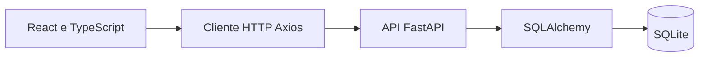

# ByteShop — arquitetura e aprendizados

Loja de peças e periféricos para estudo/portfólio. A versão consultada possui catálogo, carrinho, cadastro/login, pedidos e administração. **O pagamento é simulado**: criar um pedido já grava o estado `pago`; isso não confirma recebimento de dinheiro.

## Como as peças se conectam

| Responsabilidade | Arquivo para estudar |
|---|---|
| Configuração e validação da chave de sessão | [[Cerebro/GitHub/byteShop/Fontes/backend/app/config.py.md|config.py]] |
| Autenticação e administrador | [[Cerebro/GitHub/byteShop/Fontes/backend/app/auth.py.md|auth.py]] |
| Pedidos, baixa de estoque e total | [[Cerebro/GitHub/byteShop/Fontes/backend/app/routers/orders.py.md|orders.py]] |
| Carrinho persistido no navegador | [[Cerebro/GitHub/byteShop/Fontes/frontend/src/context/CartContext.tsx.md|CartContext.tsx]] |
| Comunicação com a API e tratamento de 401 | [[Cerebro/GitHub/byteShop/Fontes/frontend/src/api/client.ts.md|client.ts]] |
| Testes de estoque/pedidos | [[Cerebro/GitHub/byteShop/Fontes/backend/tests/test_orders.py.md|test_orders.py]] |

## Fluxo de compra observado

1. A interface envia identificadores de produto e quantidades.
2. A API busca o produto no banco e usa seu preço registrado.
3. Uma atualização condicional baixa estoque somente se houver saldo suficiente.
4. Os itens guardam nome e preço praticados, preservando a informação da compra.
5. Pedido e itens são confirmados na transação.
6. A consulta de pedidos restringe os resultados ao usuário autenticado.

## Detalhe importante para iniciar

O README diz que editar `SECRET_KEY` seria opcional. **O código atual exige a alteração:** `validate_secret_key()` recusa valores conhecidos como fracos ou com menos de 32 caracteres. Ao retomar, configure a chave em `backend/.env` antes de importar/iniciar a aplicação.

Portas documentadas: API 8000, interface 5173. O banco padrão é `ecommerce.db`. Consulte o [[Cerebro/GitHub/byteShop/Fontes/README.md.md|README preservado]] para os comandos do projeto.

## Próximos estudos úteis

- Persistência de carrinho: distinguir dados de conveniência do navegador e valores definitivos do servidor.
- Concorrência: observar a atualização condicional em pedidos.
- Sessão: entender por que o cliente remove o token e encaminha ao login após um 401 autenticado.
- Pagamento real: precisaria de integração e confirmação independente, com estados intermediários; a implementação consultada é uma demonstração.

Leitura de documentação e código realizada nesta importação. A suíte do projeto não foi executada.

[[Cerebro/GitHub/byteShop/00-Indice|Todos os arquivos]] · [[Cerebro/GitHub/Conhecimento/01-Estoque-Concorrente|Estoque concorrente]] · [[Cerebro/GitHub/00-Indice|GitHub]]

