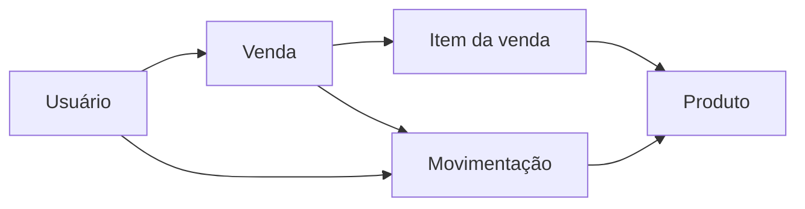

# Contro Vend — vendas, estoque e rastreabilidade

Sistema web para pequeno comércio. Na versão pública consultada, o backend é Node.js/Express, o banco é PostgreSQL via Prisma e a interface usa HTML/CSS/JavaScript servido pelo próprio backend.

## Modelo de dados

Cada movimento registra quantidade, saldo anterior, saldo novo, responsável e motivo quando aplicável. O código diferencia perfis `ADMIN` e `CASHIER`.

## Arquivos que ensinam a arquitetura

| Tema | Fonte |
|---|---|
| Entidades e relações | [[Cerebro/GitHub/contro-vend-public/Fontes/prisma/schema.prisma.md|schema.prisma]] |
| Estoque com atualização atômica | [[Cerebro/GitHub/contro-vend-public/Fontes/src/stockOps.js.md|stockOps.js]] |
| Autenticação e permissões atuais | [[Cerebro/GitHub/contro-vend-public/Fontes/src/auth.js.md|auth.js]] |
| Projeção de consumo e produtos parados | [[Cerebro/GitHub/contro-vend-public/Fontes/src/forecast.js.md|forecast.js]] |
| Venda e cancelamento | [[Cerebro/GitHub/contro-vend-public/Fontes/src/routes/sales.js.md|sales.js]] |
| Regressões de integração | [[Cerebro/GitHub/contro-vend-public/Fontes/test/integration.test.js.md|integration.test.js]] |
| Manual técnico | [[Cerebro/GitHub/contro-vend-public/Fontes/DOCUMENTATION.md.md|DOCUMENTATION.md]] |

## Soluções reaproveitáveis

- Somar ou subtrair estoque no banco, com condição de limite, evita perder movimentos concorrentes.
- Reconsultar usuário ativo e papel a cada requisição faz uma alteração administrativa valer antes da expiração do JWT.
- Guardar saldo anterior e novo torna a auditoria verificável.
- Centralizar a previsão em `forecast.js` alinha painel, relatórios e alertas.
- Manter preços e totais no servidor reduz dependência de valores alteráveis na interface.

## Como retomar

O README documenta Node local na porta 3000 ou Docker Compose na 3100. A suíte de integração utiliza PostgreSQL e **limpa o banco de teste**; seus requisitos precisam ser respeitados antes de executá-la.

A árvore pública deste commit **não contém** `src/spreadsheet.js`, `src/productImport.js` ou `src/routes/imports.js`. A nota histórica do Mercadinho descreve essas funcionalidades em outro contexto. Portanto, não se deve presumir que a importação de planilhas já esteja nesta versão pública.

[[Cerebro/Projetos/06-Mercadinho-Seu-Joao|Contexto histórico do Mercadinho]] · [[Cerebro/GitHub/contro-vend-public/00-Indice|Todos os arquivos]] · [[Cerebro/GitHub/00-Indice|GitHub]]

Leitura de código e documentação; testes anteriores mencionados pelo autor não foram repetidos nesta importação.

