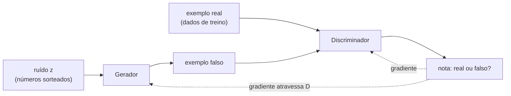

# Gerador e discriminador

Toda GAN tem duas redes neurais com papéis opostos. O **gerador** transforma ruído aleatório em um exemplo; o **discriminador** recebe um exemplo e diz se ele parece real. Elas não compartilham pesos: cada uma tem seu próprio otimizador e sua própria perda ([[03-Como-o-Treino-Funciona|como o treino funciona]]).

## O caminho dos dados



O gradiente que ensina o gerador **passa por dentro do discriminador**: o discriminador diz "se esta imagem fosse um pouco diferente assim, pareceria mais real", e o gerador ajusta seus pesos nessa direção.

## O gerador

- **Entrada:** um vetor de ruído *z*, por exemplo 100 números sorteados de uma distribuição normal. Cada sorteio diferente gera um exemplo diferente.
- **Saída:** um exemplo no formato dos dados: uma imagem 64×64 com 3 canais de cor, um ponto (x, y), um trecho de áudio.
- **Para imagens:** começa com um bloco pequeno e vai **aumentando** o tamanho com convoluções transpostas (ou com ampliação seguida de convolução), até chegar à resolução final. A última camada costuma usar `tanh`, que deixa os pixels entre −1 e 1.

```python
gerador = nn.Sequential(          # versão mínima, do exemplo 2D do cofre
    nn.Linear(8, 128), nn.ReLU(),  # 8 números de ruído entram
    nn.Linear(128, 128), nn.ReLU(),
    nn.Linear(128, 2),             # um ponto (x, y) sai
)
```

## O espaço latente

O conjunto de todos os vetores *z* possíveis é o **espaço latente**. Depois do treino, ele ganha organização:

- vetores **vizinhos** geram exemplos **parecidos**;
- andar em linha reta de um *z* a outro produz uma **transição suave** entre dois rostos, em vez de um corte;
- algumas direções passam a significar atributos. No artigo do DCGAN (2015), o vetor médio de "homem de óculos", menos "homem sem óculos", mais "mulher sem óculos", gerou mulheres de óculos.

Ninguém programou essas direções. Elas surgem porque o gerador precisa de um jeito econômico de produzir toda a variedade dos dados a partir de poucos números.

## O discriminador

- **Entrada:** um exemplo, real ou falso, sem saber qual é.
- **Saída:** um único número. Na GAN original, passa por uma sigmoide e vira a **probabilidade de ser real** (0 a 1). Na WGAN, fica sem limite e se chama **crítico**: uma nota em que maior significa "mais real" ([[05-WGAN-e-Estabilizacao|WGAN]]).
- **Para imagens:** é um classificador convolucional comum, que vai **reduzindo** a imagem até um número. Costuma usar `LeakyReLU`, que deixa passar um pouco de gradiente mesmo para valores negativos.

Depois do treino, o discriminador normalmente é **descartado**: o produto é o gerador.

## Equilíbrio de forças

As duas redes precisam estar **à altura uma da outra**:

- discriminador forte demais: rejeita tudo com certeza absoluta, e o gerador não recebe pistas úteis de como melhorar;
- discriminador fraco demais: aceita qualquer coisa, e o gerador aprende a enganar um juiz ruim.

Grande parte das técnicas de [[04-Problemas-do-Treino|estabilização]] existe para manter esse equilíbrio.

## GAN condicional: escolher o que gerar

Na GAN comum, não dá para pedir "gere um gato": o resultado depende só do sorteio. A **GAN condicional** (cGAN, Mirza e Osindero, 2014) entrega um **rótulo** às duas redes:

- o gerador recebe ruído **+ rótulo** ("gato") e precisa gerar um gato;
- o discriminador recebe exemplo **+ rótulo** e rejeita tanto o falso quanto o real com rótulo errado.

O rótulo pode ser uma classe, um texto descritivo ou até outra imagem, como no Pix2Pix ([[06-Arquiteturas-Importantes|arquiteturas]]).

## Perguntas de revisão

O que entra e o que sai do gerador de uma GAN? :: Entra um vetor de ruído aleatório e sai um exemplo no formato dos dados, como uma imagem.

O que entra e o que sai do discriminador de uma GAN? :: Entra um exemplo real ou falso e sai um número que indica se ele parece real.

Como o gerador aprende se nunca vê os dados reais? :: Pelo gradiente que atravessa o discriminador e indica como mudar a saída para parecer mais real.

O que é o espaço latente de uma GAN? :: O conjunto dos vetores de ruído de entrada; depois do treino, vetores vizinhos geram exemplos parecidos.

O que acontece ao interpolar entre dois vetores latentes de uma GAN treinada? :: Os exemplos gerados mudam suavemente de um para o outro.

O que acontece com o discriminador depois do treino? :: Normalmente é descartado; o produto final é o gerador.

Por que o discriminador não pode ser forte demais? :: Porque, rejeitando tudo com certeza, ele deixa de dar ao gerador pistas úteis de como melhorar.

O que é uma GAN condicional? :: Uma GAN em que gerador e discriminador recebem também um rótulo, o que permite escolher o tipo de exemplo gerado.

Qual função de ativação costuma ficar na saída do gerador de imagens e por quê? :: tanh, porque deixa os pixels entre −1 e 1.

---
Anterior: [[01-O-Que-Sao-GANs|O que são GANs]] · Próxima: [[03-Como-o-Treino-Funciona|Como o treino funciona]] · Trilha: [[GANs/00-Indice|GANs]]
